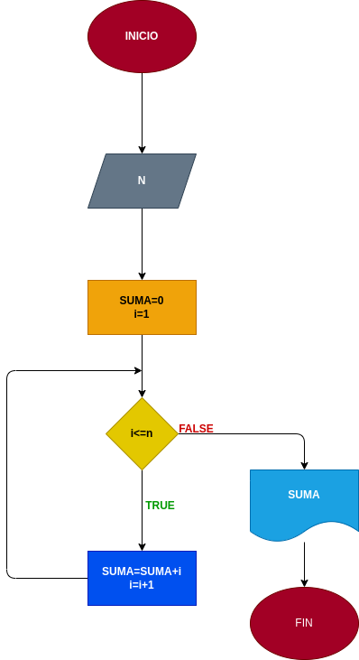

# Suma_N_naturales
## programa que sume los N numeros naturales

# ANALISIS

Variables de entrada (input)

n=numero que se ingresa

Variables de proceso (processing)

Suma=0
i=1

Variables de salida(output)

Suma=Resultado final

# DISEÑO
 
